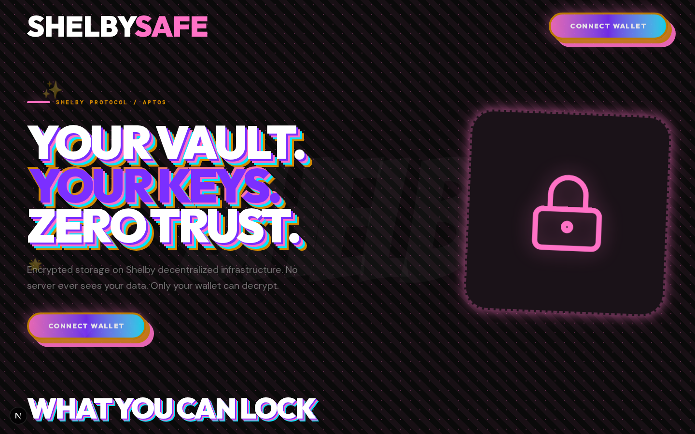

# ShelbySafe

> Encrypted vault on Shelby Protocol. Your keys. Zero trust.

Store encrypted notes on Shelby decentralized storage. AES-256-GCM encryption with wallet-derived keys. Only your wallet can decrypt.

**Live:** [shelby-safe.vercel.app](https://shelby-safe.vercel.app)



## How It Works

1. **Connect** your Aptos wallet (Petra, Nightly, OKX)
2. **Unlock** — sign a message with your wallet to derive your encryption key
3. **Create** encrypted notes — encrypted client-side, registered on-chain, then stored on Shelby Protocol
4. **Access anywhere** — same wallet = same key = same notes

No server ever sees your data. Encryption happens in your browser.

### Key Derivation (How Your Wallet Unlocks the Vault)

```
1. signMessage("ShelbySafe-Vault-v1") → signature (64 bytes)
2. SHA-256(signature) → 256-bit hash
3. Import hash as AES-GCM key via Web Crypto API
```

- The encryption key is **never stored** — it's derived deterministically from your wallet signature every time
- Same wallet + same message = same key = same notes, any device
- Different wallet → different key → cannot decrypt. Even Shelby nodes only see ciphertext
- **Tradeoff:** If your wallet is compromised, the vault can be unlocked. Mitigation: use a separate cold wallet for your vault (not your daily trading wallet)

## Features

- 🔐 AES-256-GCM client-side encryption
- 🔑 Wallet-derived keys (no password to remember)
- 📦 Decentralized storage on Shelby Protocol
- 🔒 Auto-lock after 5 minutes of inactivity
- 📤 Export all notes (decrypted JSON download)
- 📱 Mobile responsive
- ✅ Encryption tests (vitest)

## Tech Stack

- **Next.js 16** (Turbopack) + React 19 + TypeScript
- **Tailwind CSS v4** — Maximalism/Dopamine dark theme
- **@aptos-labs/wallet-adapter-react** — Petra/Nightly/OKX wallet connection
- **@shelby-protocol/sdk** — Decentralized blob storage
- **Web Crypto API** — AES-256-GCM client-side encryption
- **Vitest** — Unit tests for encryption/decryption
- **Vercel** — Deployment

## Getting Started

```bash
npm install
npm run dev
```

Open [http://localhost:3000](http://localhost:3000).

### Environment Variables

| Variable | Required | Description |
|---|---|---|
| `NEXT_PUBLIC_SHELBY_API_KEY` | No | Shelby API key (avoids rate limits) |

Copy `.env.example` to `.env.local` and add your key.

### Tests

```bash
npm test
```

## Upload & Download

**Reads** (list + download + decrypt) work fully in the browser today.

**Writes** (saving a note) are implemented end-to-end with browser wallet signing — no CLI required:

1. The note is encrypted client-side (AES-256-GCM)
2. `generateCommitments()` builds the blob's Merkle root
3. `register_blob` is signed and submitted by your wallet via `signAndSubmitTransaction` (your wallet pays gas + storage)
4. The encrypted bytes are uploaded to the Shelby RPC via `putBlob`

To run a write you need, **on ShelbyNet** (a dedicated Shelby network, separate from Aptos mainnet/testnet/devnet):

- **APT** for transaction gas
- **ShelbyUSD** for storage fees

ShelbyNet is currently early-access, so funding via the faucet requires approved access.

## Project Structure

```
├── __tests__/
│   └── encryption.test.ts  # Roundtrip, tamper, unicode tests
├── app/
│   ├── layout.tsx           # AptosWalletAdapterProvider wrapper
│   ├── page.tsx             # Main page → Vault
│   └── globals.css          # Tailwind v4 + custom animations
├── components/
│   ├── wallet-provider.tsx  # Wallet adapter bridge
│   ├── connect-wallet.tsx   # Multi-wallet selector
│   └── vault.tsx            # Main vault logic + UI
├── lib/
│   ├── encryption.ts        # AES-GCM encrypt/decrypt + key derivation
│   ├── shelby.ts            # ShelbyClient + wallet-signed upload + error classification
│   └── types.ts
└── package.json
```

## License

MIT
